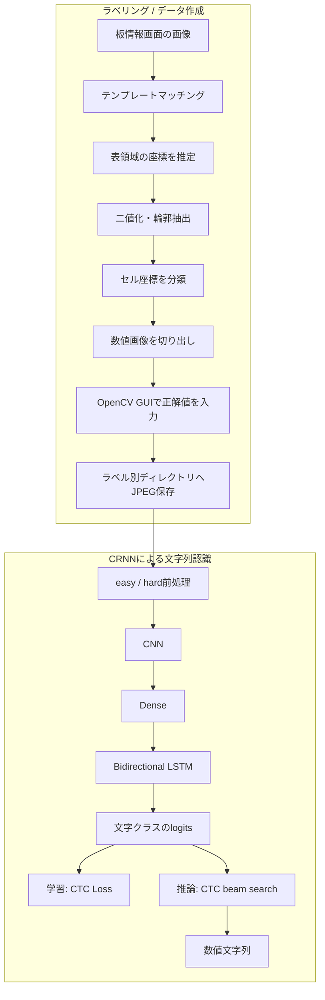

# CRNN AI-OCR / ラベリング支援ツール

> **Historical Project / 開発時期：2025年12月頃**

板情報画面に表示される価格などの数値を、文字列単位で認識するために作成したOCRです。TensorFlow / KerasによるCRNNに加え、画面の構造を利用して学習画像を切り出し、正解値の入力と保存を支援するOpenCVベースのラベリングツールを含みます。

このProjectで主に示したいのは、次の実装経験です。

- CNN、Bidirectional LSTM、CTC Lossを組み合わせた文字列認識
- OpenCVによる画像前処理、テンプレートマッチング、輪郭座標の分類
- 画面画像からラベル付きJPEGを作るデータ作成パイプライン
- easy / hardの前処理とaugmentation
- 文字の出現頻度に応じたLoss重み付け

公開できる性能資料は残していないため、本READMEは性能の証明ではなく、当時実装したモデル、画像処理、データ作成の構成を説明するものです。

## 開発背景・目的

以前は、切り出した文字を1文字ずつ分類するMNIST型のOCRを使用していました。本Projectでは、文字の分割を前提とせず数値文字列をまとめて認識する方法としてCRNNを採用しました。

対象となる学習データを自分で作る必要があったため、OCRモデルだけでなくラベリング支援ツールも作成しています。板情報画面の表示位置が規則的であることや、並んだ数値に一定の関係があることを利用し、表領域の検出、セル画像の切り出し、連続入力の補助を行いました。

## システム構成

## データ作成・ラベリング

`OCRST.py`と`labeling.py`がラベリング処理を担当します。

1. 非公開の4枚のテンプレート画像を使い、画面全体に対してテンプレートマッチングを行います。
2. 検出座標を重複除去し、画面の規則的な配置から各表領域の座標を組み立てます。
3. 各領域を二値化して輪郭を抽出し、x・y座標を基準にセル単位へ分類します。
4. 売り・買い側で輪郭が存在しないセルについては、中央の価格列のy座標を基準に空の要素を補完します。
5. 対象セルの数値画像を切り出し、幅155×高さ40の画像へそろえます。
6. OpenCVの画面上で正解値を入力します。直前の入力値と補正値を利用した連続入力や、列・セル単位のスキップにも対応しています。
7. 入力した文字列をディレクトリ名として、画像をJPEG形式で保存します。小数を含む入力は小数第1位までに整形し、桁区切りのカンマを付けます。

学習側では、ラベル文字列をディレクトリ名から読み取ります。画像探索の対象は`.jpg`、`.jpeg`、`.png`です。

## CRNNと学習処理

### モデル構成

入力画像は幅155×高さ40にそろえ、グレースケール化した後、TensorFlow側で`(155, 40, 1)`の形へ転置します。認識対象は数字、カンマ、小数点からなる文字列です。

モデルは次の順に構成されています。

1. `Conv2D`、Batch Normalization、MaxPoolingを組み合わせたCNNブロック
2. CNN特徴量を時系列として扱うためのReshape
3. Dense層
4. 複数のBidirectional LSTM層（Dropoutを設定可能）
5. 各時刻の文字クラスに対するlogitsを出力するDense層

学習時は`tf.nn.ctc_loss()`を使用し、推論時は`tf.nn.ctc_beam_search_decoder()`で文字列へ復号します。

### 前処理とaugmentation

元データは同一画面のスクリーンショット由来で、比較的整った画像でした。その画像だけに適合しすぎることを抑える意図で、学習用データにはeasy / hardの2種類の前処理を用意しています。

- **easy**：文字領域を切り出し、白背景へ中央配置します。
- **hard**：文字領域の切り出し後、ランダムな拡大縮小・回転・透視変換・ぼかし・背景変更・欠損を適用し、TensorFlow側で明るさ、コントラスト、ノイズも加えます。

学習データセットは同じ元画像から作ったhardとeasyを連結するため、コード上はHard:Easy = 1:1です。validationとfinal testにはeasy前処理を使用します。

### 文字頻度に応じたLoss重み付け

対象文字の出現頻度に偏りがあったため、学習用ラベルに含まれる各文字の出現数から重みを計算しています。文字`c`の重みは、全文字数を`N`、文字`c`の出現数を`n_c`として、コード上では`log(N / n_c)`です。

各サンプルについて、パディングを除いた文字重みの平均を求め、その値をサンプル単位のCTC Lossへ乗算します。これにより、頻出文字の影響を相対的に小さくし、出現頻度の低い文字を相対的に強く扱うことを意図しています。重みは学習ラベルから算出され、学習とvalidationのLoss計算で共有されます。

### 学習と評価

`OCRTrainImage`を学習用90%・validation用10%に分割し、別の`OCRTestImage`をfinal testとして読み込む構成です。学習時にはvalidation Lossを監視し、ModelCheckpoint、学習率低減、Early Stoppingを使用します。

コードに実装されている主な評価指標は次の2つです。

- **完全一致率（Complete Match）**：予測文字列が正解文字列と完全に一致した割合
- **文字列類似度**：`difflib.SequenceMatcher.ratio()`による正解文字列と予測文字列の類似度

後者はCERではありません。現在の公開物には、性能を示す学習グラフや評価数値は含めていません。

## 使用技術

- Python
- TensorFlow / Keras：CRNN、CTC Loss、学習・推論処理
- OpenCV：テンプレートマッチング、二値化、輪郭抽出、画像変換、ラベリングGUI
- NumPy：画像・座標配列の処理
- Pillow：ラベリング画像のJPEG保存
- scikit-learn：学習データとvalidationデータの分割
- Matplotlib：学習・評価結果のグラフ出力

## 本人の実装範囲・生成AI利用

板情報画面の構造と数値の規則性を観察し、データ作成とラベリングを効率化するという問題設定・方向性は作者が考えました。

CRNNの学習・推論部分は生成AIの支援を大きく受けて実装しています。ラベリングツールにも生成AI支援を利用していますが、CRNN側と比べて作者が直接作成した部分が多いという認識です。正確な割合は記録していないため数値化していません。

完成後の公開整理では、ChatGPT / Codexによるコード監査と修正支援を利用しています。

## 主要コード

| ファイル | 役割 |
| --- | --- |
| [`OCRST.py`](./OCRST.py) | テンプレートマッチング、表・セル座標の推定、ラベリング用画像の整形 |
| [`labeling.py`](./labeling.py) | 正解値のGUI入力、連続入力の補助、ラベル別JPEG保存 |
| [`data_utils.py`](./data_utils.py) | データ探索、画像デコード、easy / hard前処理、`tf.data`データセット作成 |
| [`model.py`](./model.py) | CRNNモデル、文字頻度重み付きCTC Loss、beam search decode |
| [`train.py`](./train.py) | データ分割、学習、validation監視、final test |
| [`evaluate_accuracy.py`](./evaluate_accuracy.py) | テストデータに対する完全一致率と文字列類似度の集計 |
| [`predict.py`](./predict.py) | config・学習済みモデル・画像を指定する単一画像推論 |

## Projectの結果と現在の位置づけ

CRNNは当時、学習と評価まで実施しました。その後まもなく、同じ情報をOCRではなく構造化データとして取得できるAPIの存在を知り、OCRを継続運用するよりAPIを利用する方が合理的と判断しました。そのため、このCRNNは実運用せず、データ取得方法をAPIへ切り替えています。API接続の実装は本Projectには含まれません。

現在は、CRNNによる文字列認識、対象画面の構造を利用した画像処理、学習データ作成の取り組みを確認するためのHistorical Projectとして公開しています。

## 公開上の制約

- 学習用画像と評価用画像は公開していません。
- 学習済みモデルおよびweightは公開していません。
- 外部画面由来のテンプレート画像は公開していません。ラベリングツールの領域検出はこれらの画像に依存します。
- 過去の実行環境を完全に再現できる依存ライブラリのバージョン情報は残っていません。
- 学習・評価スクリプトは、非公開のデータ配置とローカルのパス指定ファイルを前提としています。

以上の理由から、公開しているファイルだけで学習結果を完全再現することはできません。公開範囲は、当時のコード、設計、データ作成処理を確認するためのものです。
