# DDQN Short Explicit Agent History E0 統合技術レポート

- **Report ID**: `ddqn_short_explicit_agent_history_e0_integrated_report_v01`
- **Report date**: 2026-08-27
- **Project**: `daytrading_rl_system_v2`
- **Scope**: 2026-08-24 baseline → Lag-1 E0 → reward/Q read-only diagnostic → Lag-2/Lag-3 E0
- **Experiment stage**: E0-1 / E0-2 / post-E0 diagnostic
- **Current canonical state**: `59 / mask 59 / Q input 118`（変更なし）
- **Explicit-history candidates**: L1 `65/130`, L2 `71/142`, L3 `77/154`
- **Algorithm used for final memory-depth comparison**: Double DQN (DDQN)
- **Final explicit-history verdict**: `E0 signal detected, no E1 promotion; explicit-history phase closed`
- **Next design direction**: より一般的な時系列情報の扱い（未設計・未実装・未承認）
- **Formal evaluation / fresh clean OOS / production candidate**: `false / false / false`

## 1. Executive summary

本研究は、2026-08-24時点のDDQN baselineで観測された高頻度のshort-cycle churnに対し、**直前のagent position/action履歴をstateへ明示的に追加したvariantで、policyに改善方向の変化が見られるか**をE0で検証した。

研究は三段階で進んだ。

1. **Lag-1**: 直前1 decision（約5秒）のposition/actionを追加。
2. **Read-only diagnostic**: Lag-1で5秒再Entryが減ったように見えたため、reward・Q・Close後時間依存を再解析。
3. **Lag-2 / Lag-3**: 2 / 3 decisions（約10 / 15秒）へ履歴窓を延長し、DDQNとhidden幅を固定し、history depthに伴って入力次元・parameter数が異なるvariantを比較。

結論は次のとおりである。

1. **実装・学習・比較healthはPASSした。** state/mask/Q shape、history queue、session reset、Replay、DDQN Bellman target、finite gate、strict reload、GPU、6/6 run、全graph/data artifactが成立した。
2. **Lag-1単独はeconomic performanceを改善しなかった。** DQNではmean normalized PnLが`-0.252624 → -0.324586`、DDQNでは`-0.312885 → -0.319973`となり、E1昇格根拠はなかった。
3. **Lag-1はpolicyに利用されたが、期待した方向ではなかった。** Close直後とcontinuous Flatでaction/Qが大きく異なった一方、DDQNの5秒再Entry低下の多くは5秒から10秒への1 decision遅延だった。
4. **Lag-2 / Lag-3ではmemory depthに応じたsignalが現れた。** L3はmean PnL `-0.235553`、median `-0.096920`、positive episode `25/432`、entries/episode `593.42`、mean holding `27.44s`となり、B0/L1より中心性能と一部behaviorが改善した。
5. **ただしL3を採用できるほど安定していない。** 3 seed中1 seedは大幅悪化し、p01、worst-5% mean、maximum lossは悪化した。holding medianは全variantで5秒、L3でも5秒Close率は`60.76%`、Close後5秒以内再Entry率は`84.22%`だった。
6. **Window-drop仮説は限定的に支持された。** Close contextがexplicit historyから落ちた直後、same-side re-entry率はL1/L2/L3で約`+8.5〜+9.8pp`増加した。ただしこれはその時点までFlatで残ったrisk setへの条件付き率であり、全Closeの主因ではない。L3の+20秒drop risk setは元のClose anchorの約`3.85%`にすぎない。
7. **強い単純仮説は反証された。** 「historyを伸ばせば総Entry spikeが10→15→20秒へ単純移動する」はL3で成立せず、「L3でClose後再Entry問題が解決した」も成立しない。
8. **次の研究方向として後続の時系列モデルは合理的だが、勝利保証ではない。** explicit history depthを0→3へ伸ばすとpolicy・中心PnLが動いたため、学習可能memoryを調べる理由は増えた。一方、seed/tail/5秒Close問題が残るため、後続の時系列モデルは新しいE0 architectureとして設計すべきである。

### 1.1 Integrated PM judgment

| 領域 | 判断 |
|---|---|
| Implementation / runtime health | PASS |
| Lag-1 economic signal | 不支持 |
| Lag-2 economic signal | 弱い・mixed |
| Lag-3 central economic signal | 支持方向 |
| Lag-3 seed robustness | 不十分 |
| Lag-3 extreme tail | 悪化 |
| Close後5秒再Entry問題 | 未解決 |
| Window-drop same-side mechanism | descriptive signalあり、因果未確立 |
| Explicit-history E1 promotion | NO |
| Fixed Lagをさらに増やす | 優先しない |
| Next design | より一般的な時系列情報の扱いの新規設計 |
| Current canonical stateへの統合 | NO（59列を維持） |

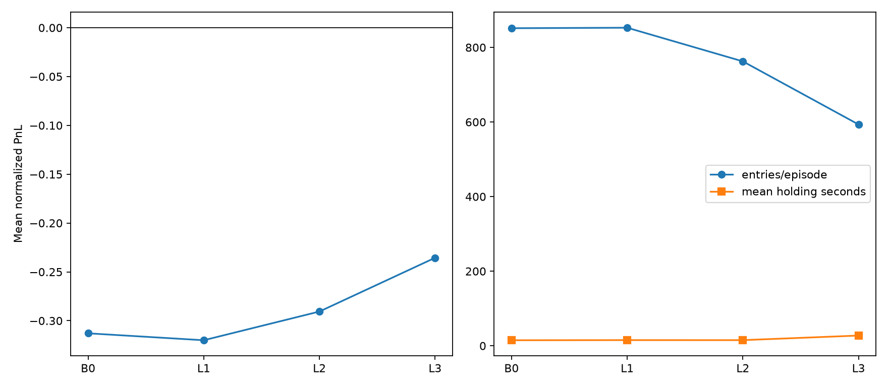

*Figure 1 (source G22): memory depthとmean normalized PnL、entries/episode、mean holdingの関係。改善方向は見えるが、異なるmetricは別panelであり因果を意味しない。*

## 2. Scope and evidence boundary

### 2.1 対象

- 8/24 current latency-1s / closing-risk DDQN baseline（B0）
- Lag-1 Agent Transition Context（DQN・DDQN E0）
- Lag-1 reward/Q/time-since-close read-only diagnostic
- DDQN Lag-2 / Lag-3 E0-1、E0-2
- 3 seeds: `20260815`, `20260821`, `20260822`
- fixed `update_2000` primary comparison
- development diagnostic population
- economic、tail、learning-health、trading behavior、window-drop、Q diagnostics

### 2.2 対象外

- formal training / formal evaluation
- fresh clean OOS
- production candidate判定
- explicit-history candidateのE2統合
- 後続の時系列モデル実装
- n-step、NoisyNet、Rainbow、reward redesign
- paper/live trading、broker接続、実注文

### 2.3 Evidence role

| Evidence | Role | Formal performance evidenceか |
|---|---|---:|
| E0-1 smoke | implementation / observability / compute health | No |
| E0-2 fixed development diagnostic | hypothesis direction / candidate screening | No |
| post-E0 read-only diagnostic | mechanism / reconstruction / falsification | No |
| Git commit | source durability | performance evidenceではない |

同じdevelopment populationを研究判断へ使用済みであるため、本reportの結果はfresh OOSでも独立final evaluationでもない。

## 3. Background

8/24 DDQN baselineは、mean normalized PnL `-0.312885`、entries/episode `851.55`、mean holding `14.89s`、5秒Close `74.70%`、Close後5秒以内re-entry `88.40%`だった。current 59-stateでは、Close成功後にposition/holding/entry-related stateがFlat用へ戻るため、**ずっとFlatだったstate**と**直前までLong/ShortでCloseした直後のFlat**を直接区別しにくい。

そこで、market50を複製せず、agent transitionの事実だけを追加するlow-cost probeを設計した。

## 4. Candidate design

### 4.1 Variant definition

| Variant | Explicit history | State | Mask | Q input | Trainable parameters |
|---|---:|---:|---:|---:|---:|
| B0 | なし | 59 | 59 | 118 | 32,131 |
| L1 | 1 decision（約5秒） | 65 | 65 | 130 | 33,667 |
| L2 | 2 decisions（約10秒） | 71 | 71 | 142 | 35,203 |
| L3 | 3 decisions（約15秒） | 77 | 77 | 154 | 36,739 |

B0/L1/L2/L3はend-to-endのmodel variant比較であり、parameter budgetを一致させたablationではない。L3はB0より4,608 parameters（約14.34%）多く、historyだけが改善を生んだとは断定しない。

1 history blockは6列である。

```text
position-before: Flat / Long / Short  (3-way one-hot)
final effective action: Hold / Buy / Sell (3-way one-hot)
```

raw Q argmaxではなく、mask/gate/fallback後に実際にEnvへ渡したsemantic actionを保存した。historyはsame-sessionのみで、午前・午後の最初は全lag unavailable、position自体は既存Env契約どおり昼休みを越えて維持した。

### 4.2 Temporal semantics

現在decisionを`t`とすると、L3では次を観測する。

```text
prev1 = position/action at t-1
prev2 = position/action at t-2
prev3 = position/action at t-3
```

`action_t`を`state_t`へ先に入れるaction leakageは禁止し、transition後のnext stateでqueueを1つ進めた。

## 5. Fixed experiment contract

| Field | Contract |
|---|---|
| Algorithm | Double DQN（final depth comparison） |
| Network | Dense128 → Dense128 → 3 |
| Gamma | 0.9962 |
| Backup | one-step |
| Reward | current v0.1 liquidation-equity difference |
| Replay | uniform, capacity 50,000 |
| Batch | 128 |
| Loss | Huber, delta=1 |
| Optimizer | Adam, 1e-3 |
| Gradient clip | global norm 10 |
| Target sync | hard, every 200 updates |
| Training dates | 2026-06-24 / 25 / 26 / 29 |
| Development dates | 2026-06-30 / 07-01 / 07-03 |
| Training episodes | 192 / run |
| Updates | 2,000 / run |
| Development episodes | 144 / seed / checkpoint |
| Checkpoints | 0 / 250 / 500 / 1000 / 1500 / 2000 |
| Primary checkpoint | fixed update_2000 |
| Seeds | 20260815 / 20260821 / 20260822 |

## 6. Mathematical contract

### 6.1 Step reward

$$
r_t = \frac{E_t-E_{t-1}}{100\,P_{\mathrm{prevclose}}}
$$

- `r_t`: step `t`のnormalized reward
- `E_t`: action実行後のliquidation equity
- `E_(t-1)`: 直前のvalid equity
- `P_prevclose`: PreviousClose
- `100`: fixed share quantity

### 6.2 Episode return

$$
J_{episode}=\sum_t r_t
$$

reward-valid episodeではequity差分がtelescopingするため、step reward和とfinal normalized PnLが一致する。Lag-1 read-only監査では320万step超でidentityを確認した。

### 6.3 Double DQN next-action selection

$$
a^*=\arg\max_{a\in\mathcal A_{t+1}}Q_{online}(s_{t+1},a)
$$

online networkがnext actionを選び、target networkがそのactionを評価する。

### 6.4 Double DQN Bellman target

$$
y_t=r_t+\gamma(1-d_t)Q_{target}(s_{t+1},a^*)
$$

- `y_t`: Bellman target
- `gamma=0.9962`
- `d_t`: terminalなら1
- `Q_target`: hard-sync target network

### 6.5 TD error

$$
\delta_t=y_t-Q_{online}(s_t,a_t)
$$

TD error低下はBellman consistencyの改善を示すが、PnL改善を保証しない。本研究ではloss/TDが低下してもreward/PnLは非単調・negativeだった。

### 6.6 Close-to-re-entry CDF

$$
F(\tau)=\frac{\#\{\text{Close後}\ \tau\text{秒以内に再Entry}\}}{\#\{\text{successful normal Close}\}}
$$

G11は全Closeを固定分母とする累積割合である。

### 6.7 Window-drop conditional rate

$$
h_{same}(\tau)=\frac{\#\{\text{時刻}\ \tau\text{でsame-side Entry}\}}{\#\{\tau\text{まで再EntryせずFlatで残ったdecision}\}}
$$

G16はrisk setが時間とともに縮む条件付き率であり、G11と分母が異なる。したがって31%を「全Closeの31%」と解釈してはならない。

## 7. Implementation and execution health

### 7.1 E0-1

- Lag-1: state65/mask65/Q130、strict reload PASS
- Lag-2: state71/mask71/Q142、CPU smoke 2 episodes / 50 updates PASS
- Lag-3: state77/mask77/Q154、CPU smoke 2 episodes / 50 updates PASS
- focused/regression tests、compile、config parse、schema mismatch reject、history invariant PASS

### 7.2 E0-2

Lag-2 ×3 seeds + Lag-3 ×3 seedsの6 full runを実行した。

- 6/6 PASS
- 192 training episodes/run
- 2,000/2,000 updates/run
- 144 development episodes × 6 checkpoints
- Replay committed `713,945/run`
- discard/skip/nonfinite/missing gradient/execution/valuation/terminal failure `0`
- strict checkpoint reload PASS
- GPU actual tensor placement: NVIDIA GeForce RTX 5070 Ti / `GPU:0`
- total runtime: 約18時間37分

Lag-2 seed 20260815はoperational interruptionで一度停止した。Replay、optimizer state、episode cursor、RNGが保存されていなかったため、weights-only resumeを偽装せず、failed attemptを保存して同一cellをfresh startした。performance理由のretryは0である。

## 8. Phase I — Lag-1 result

Lag-1はcurrent 59 stateへ直前position/action 6列を追加した。E0-2ではDQN/DDQNを各3 seeds実行した。

| Algorithm | Baseline mean | L1 mean | Delta | Seed improvement |
|---|---:|---:|---:|---:|
| DQN | -0.252624 | -0.324586 | -0.071962 | 1/3 |
| DDQN | -0.312885 | -0.319973 | -0.007087 | 1/3 |

Lag-1はpolicyに無視されなかった。continuous Flatとjust-closed FlatでEntry率/Qが大きく異なった。しかしDQNはentries/episode増加・holding短縮・PnL悪化、DDQNは5秒Close/5秒再Entryを減らしたもののeconomic improvementがなかった。

### 8.1 Reward / TD diagnostic

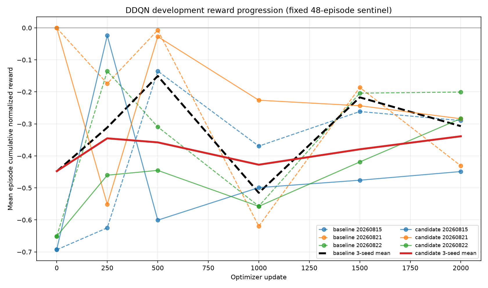

*Figure 2: DDQN checkpoint reward progression。loss/TDは低下したが、fixed development rewardは非単調で最後までnegativeだった。*

Lag-1 DDQNではloss last-50が`0.143741 → 0.000596`、|TD error|が`0.428201 → 0.015887`へ低下したが、mean rewardはnegativeのまま推移した。これは「悪いrewardを学べなかった」というより、**Bellman targetへの整合がeconomic policy improvementへ伝播しなかった**ことを示す。

### 8.2 Five-second improvementの再解釈

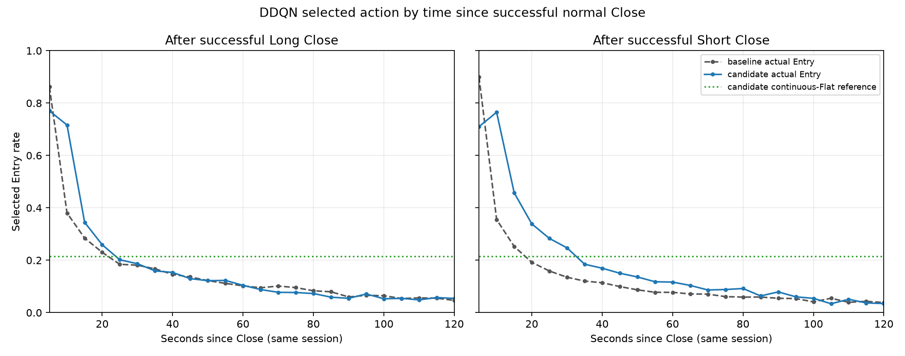

*Figure 3: Lag-1 DDQNのClose後Entry率。5秒だけでなく10秒でも高く、5秒再Entry低下の多くは1 decision遅延だった。*

DDQNのClose後5秒以内re-entryは`88.40% → 73.35%`へ低下したが、candidateは10秒以内に`93.26%`へ達した。したがって「再Entryを抑制した」ではなく、「一部を5秒から10秒へ移した」が正確である。

## 9. Phase II — Lag-2 / Lag-3 economic result

### 9.1 Central metrics

| Variant   |   Mean normalized PnL |   Median normalized PnL |   Mean JPY PnL | Positive episode rate   |   Cumulative normalized reward |
|:----------|----------------------:|------------------------:|---------------:|:------------------------|-------------------------------:|
| B0        |             -0.312885 |               -0.28675  |        -553440 | 0.00%                   |                       -135.167 |
| L1        |             -0.319973 |               -0.277612 |        -566418 | 1.16%                   |                       -138.228 |
| L2        |             -0.290586 |               -0.259723 |        -685676 | 3.24%                   |                       -125.533 |
| L3        |             -0.235553 |               -0.09692  |        -532000 | 5.79%                   |                       -101.759 |

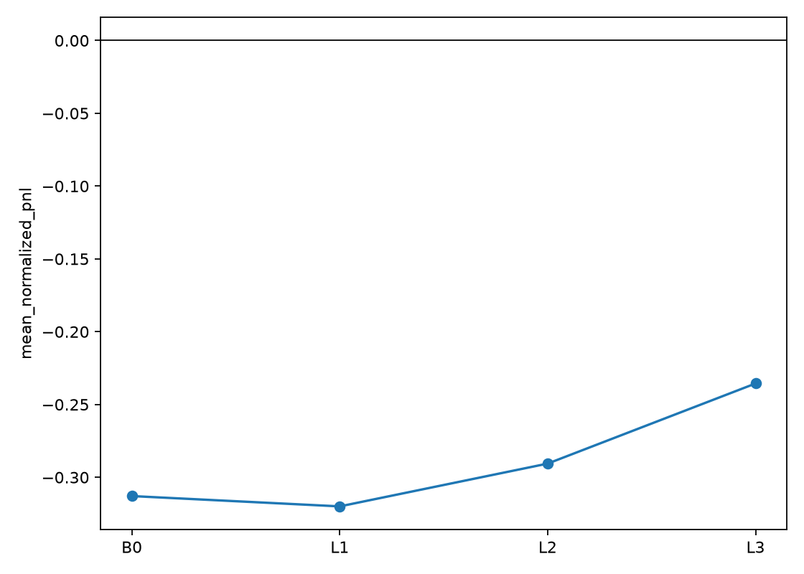

*Figure 4 (G02): memory depthとmean PnL。L2/L3は改善方向だが、independent trainingされた候補間のdescriptive relationである。*

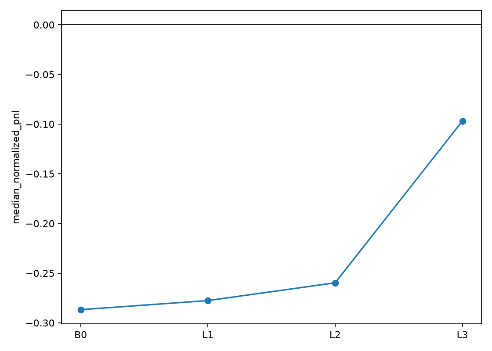

*Figure 5 (G03): L3 medianは大きく0へ近づいた。meanよりmedianが良いことは、一部の大損が平均を下へ引いていることを示す。*

L3はmean `-0.235553`、median `-0.096920`、positive `25/432`まで改善した。しかしpositive episodeは5.79%にとどまり、利益モデルではない。

### 9.2 Seed stability

| variant   | seed     |   Mean PnL |   Median PnL |
|:----------|:---------|-----------:|-------------:|
| B0        | 20260815 |  -0.299585 |    -0.260498 |
| B0        | 20260821 |  -0.424004 |    -0.377184 |
| B0        | 20260822 |  -0.215067 |    -0.130561 |
| B0        | all      |  -0.312885 |    -0.286750 |
| L1        | 20260815 |  -0.428695 |    -0.329783 |
| L1        | 20260821 |  -0.271552 |    -0.207007 |
| L1        | 20260822 |  -0.259671 |    -0.240267 |
| L1        | all      |  -0.319973 |    -0.277612 |
| L2        | 20260815 |  -0.204095 |    -0.105557 |
| L2        | 20260821 |  -0.396736 |    -0.377741 |
| L2        | 20260822 |  -0.270927 |    -0.203500 |
| L2        | all      |  -0.290586 |    -0.259723 |
| L3        | 20260815 |  -0.465435 |    -0.384509 |
| L3        | 20260821 |  -0.038071 |    -0.031957 |
| L3        | 20260822 |  -0.203152 |    -0.077034 |
| L3        | all      |  -0.235553 |    -0.096920 |

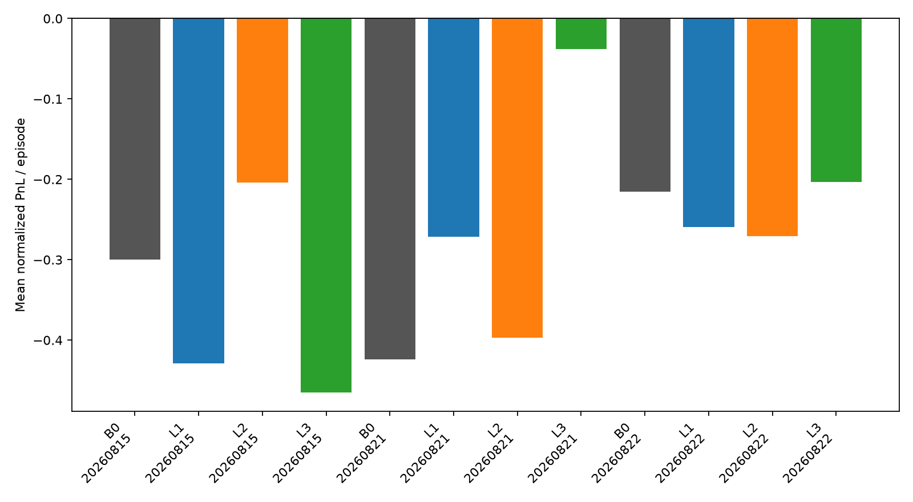

*Figure 6 (G01): L3は20260821で大幅改善、20260822でも改善したが、20260815では悪化した。*

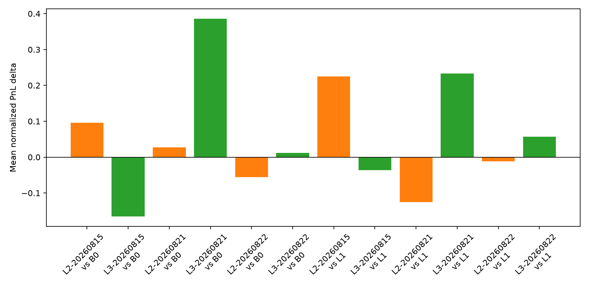

*Figure 7 (G21): positiveはcandidate優位。L3はB0比2/3 seedsで改善したが、一貫性は不足。*

### 9.3 Tail risk

| Variant   |       p05 |      p01 |   Worst 5% mean |   Maximum loss |
|:----------|----------:|---------:|----------------:|---------------:|
| B0        | -0.814288 | -1.24452 |        -1.09488 |       -1.46535 |
| L1        | -0.693026 | -1.49849 |        -1.17944 |       -2.24818 |
| L2        | -0.742626 | -1.27067 |        -1.01549 |       -1.93252 |
| L3        | -0.69867  | -1.63887 |        -1.19755 |       -2.34526 |

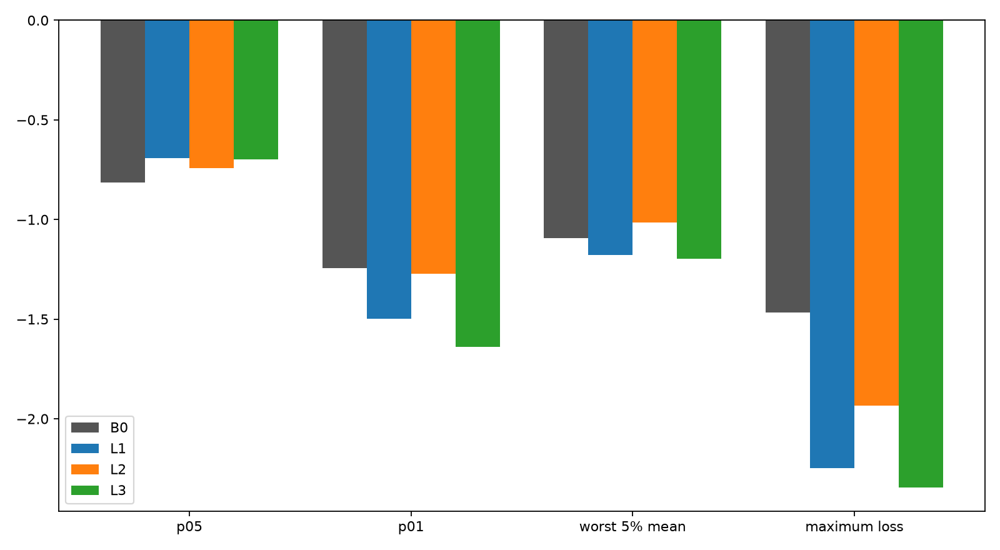

*Figure 8 (G04): L3はp05が改善する一方、p01、worst 5%、maximum lossは悪化。中心改善と極端損失は両立している。*

## 10. Trading behavior

| Variant   |   Entries/episode |   Mean holding sec |   Median holding sec | 5s Close rate   | ≤5s re-entry rate   | Hold rate   | Buy rate   | Sell rate   | Long Hold rate   |
|:----------|------------------:|-------------------:|---------------------:|:----------------|:--------------------|:------------|:-----------|:------------|:-----------------|
| B0        |            851.55 |              14.89 |                    5 | 74.70%          | 88.40%              | 54.20%      | 22.90%     | 22.90%      | 63.68%           |
| L1        |            852.83 |              15.26 |                    5 | 59.98%          | 73.35%              | 54.13%      | 22.93%     | 22.94%      | 62.06%           |
| L2        |            762.6  |              15.17 |                    5 | 61.34%          | 85.55%              | 58.98%      | 20.51%     | 20.51%      | 78.51%           |
| L3        |            593.42 |              27.44 |                    5 | 60.76%          | 84.22%              | 68.09%      | 15.96%     | 15.96%      | 86.26%           |

### 10.1 Entries and holding

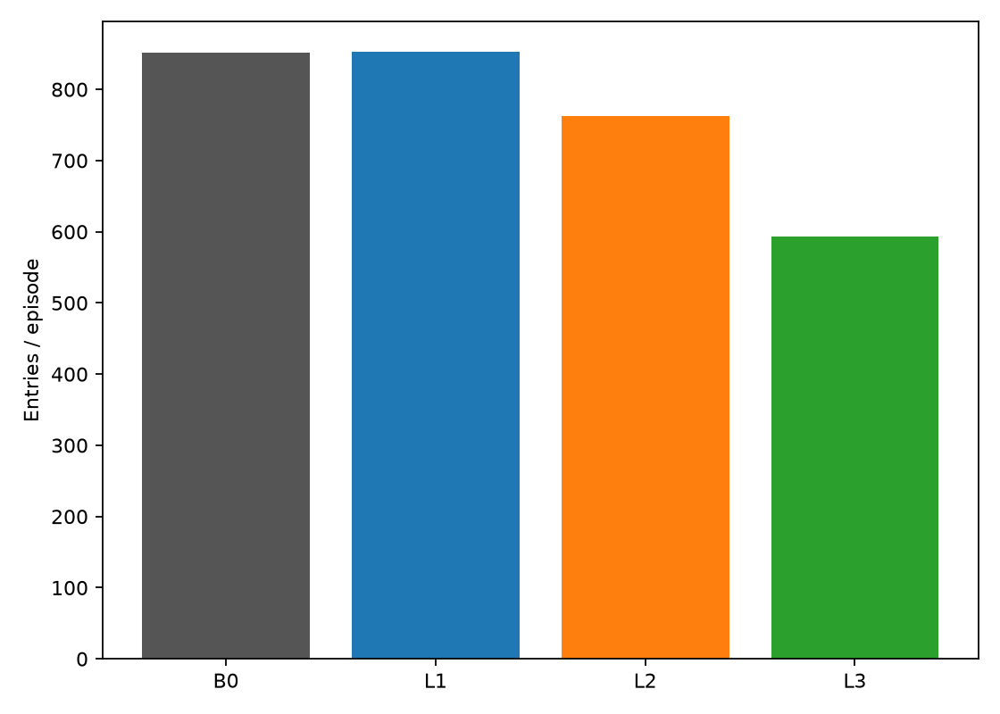

*Figure 9 (G08): L3はentries/episodeを約852から593へ削減。*

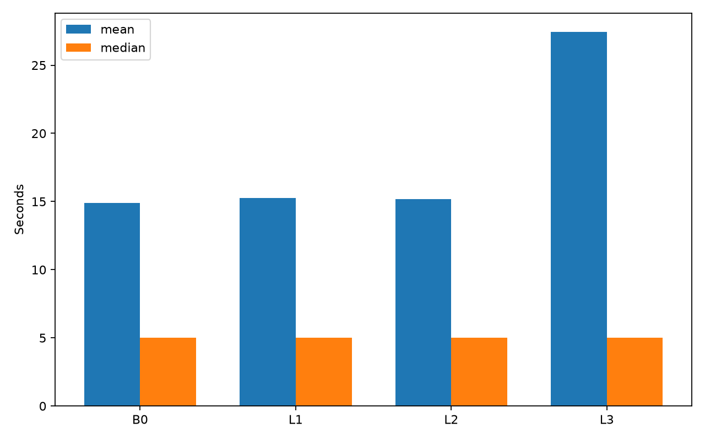

*Figure 10 (G09): L3 mean holdingは27.44秒だが、medianは全variantで5秒。典型tradeが27秒になったのではなく、一部を長く持つようになった。*

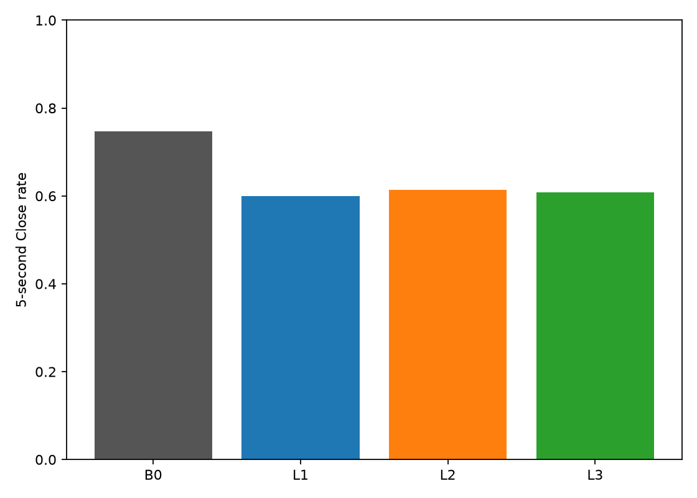

*Figure 11 (G10): L3でも5秒Closeは60.76%。過半数は依然として最短holdでCloseする。*

L3の主なbehavior signalは、Close後に長く休むことより、**そもそも保有中にHoldを選び、Close/Entryサイクル総数を減らしたこと**にある。Long position中のHold率はB0/L1/L2/L3で`63.68 / 62.06 / 78.51 / 86.26%`だった。

### 10.2 Close-to-re-entry CDF

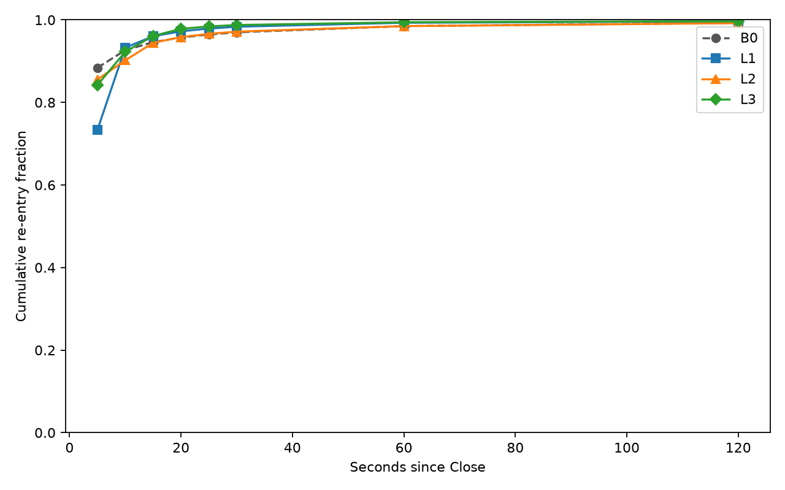

*Figure 12 (G11): 全successful normal Closeを分母とする累積割合。L3でも84.22%が5秒以内、ほぼ全てが30秒程度で再Entryする。*

L3はClose後再Entryを解決していない。一度Closeしたcaseの大半は依然として直後に再Entryする。L3の改善は「Close後cooldown」ではなく、「Close自体の減少」に近い。

## 11. Window-drop mechanism and denominator warning

### 11.1 Conditional window-drop result

| Variant   | Last present   | First dropped   | Same-side present   | Same-side dropped   | Delta pp   | Total Entry present   | Total Entry dropped   |   Drop decisions |   Anchor decisions | Drop risk-set / anchor   | Same-side dropped / anchor   |
|:----------|:---------------|:----------------|:--------------------|:--------------------|:-----------|:----------------------|:----------------------|-----------------:|-------------------:|:-------------------------|:-----------------------------|
| L1        | +5s            | +10s            | 50.92%              | 59.40%              | +8.48 pp   | 73.38%                | 74.84%                |           98,010 |            368,229 | 26.62%                   | 15.81%                       |
| L2        | +10s           | +15s            | 23.29%              | 33.07%              | +9.78 pp   | 32.28%                | 43.28%                |           32,153 |            329,281 | 9.76%                    | 3.23%                        |
| L3        | +15s           | +20s            | 22.20%              | 31.00%              | +8.80 pp   | 49.86%                | 44.52%                |            9,862 |            256,155 | 3.85%                    | 1.19%                        |

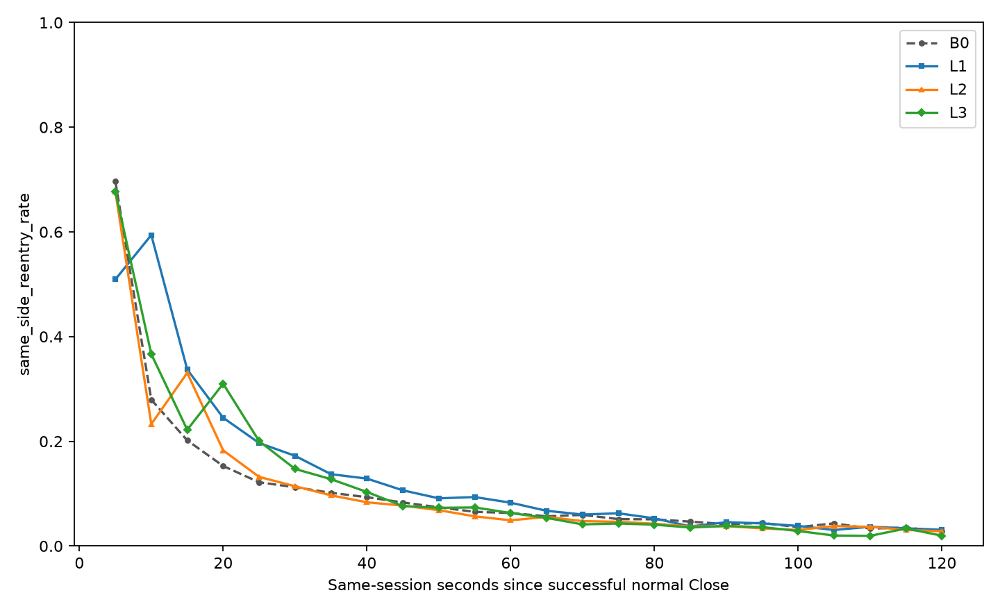

*Figure 13 (G13): Close後、まだFlatで残るrisk setにおけるsame-side re-entry率。時間経過で母集団が変わる。*

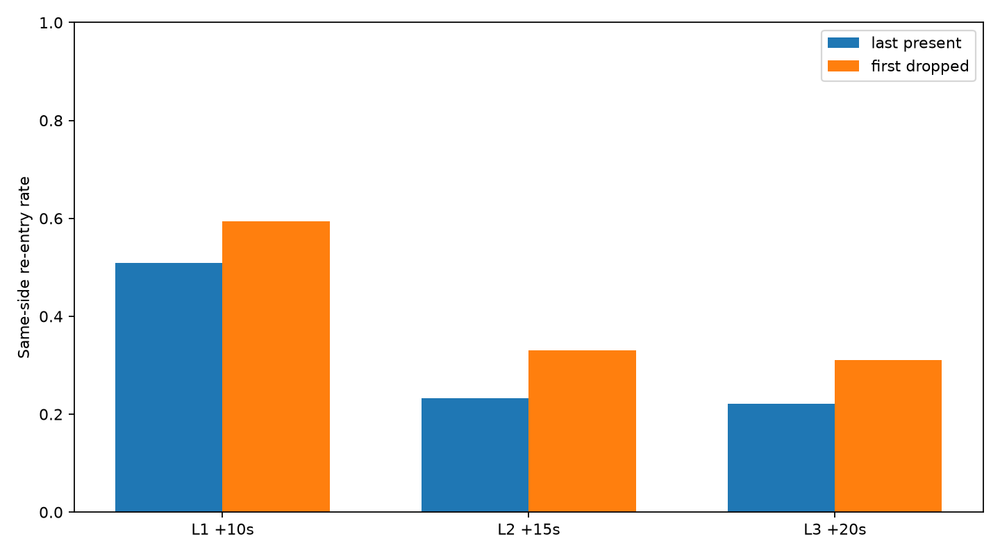

*Figure 14 (G16): explicit Close contextが最後に存在するstepと、初めて消えるstepのsame-side率。全L1/L2/L3で約9pp増加。*

L1/L2/L3のすべてで、Close contextがhistoryから落ちた直後にsame-side re-entry率が約9pp増加した。このpatternはmechanism evidenceとして興味深い。

ただし分母は固定ではない。L3では最初のClose anchor `256,155`件に対し、+20秒までFlatで残ったdecisionは`9,862`件（約3.85%）、そこでsame-side Entryしたのは`3,057`件（anchorの約1.19%）である。したがってG16は**少数のsurvivorに対する条件付き現象**であり、全体churnの主因と解釈してはならない。

### 11.2 Same-side vs reversal

L3の+15秒→+20秒では、same-sideは`22.20% → 31.00%`へ増え、reversalは`27.66% → 13.53%`へ低下した。その結果、total Entryは`49.86% → 44.52%`へ減少した。よって「historyが消えたらとにかくEntryが増える」ではなく、**Entry方向が元のsideへ偏る**が正確である。

## 12. Q behavior

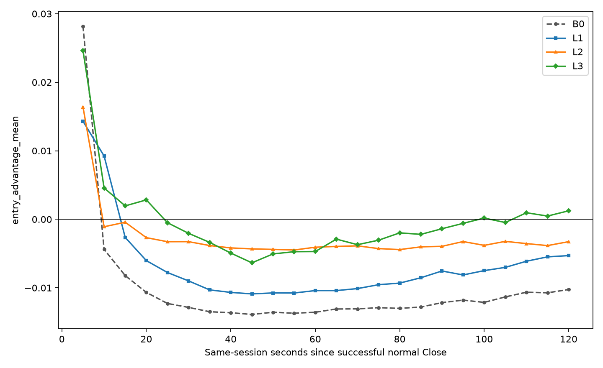

*Figure 15 (G17): best Entry Q − Hold Q。0より上ならEntry優位。risk setが時間とともに変わるdescriptive diagnosticである。*

history depthはQ rankingにも影響した。L3ではEntryとHoldが拮抗する区間が増え、Hold増加・Entry減少と整合する。しかしmarket-state matched causal comparisonではないため、history自体が原因とは断定しない。

## 13. Learning health vs performance

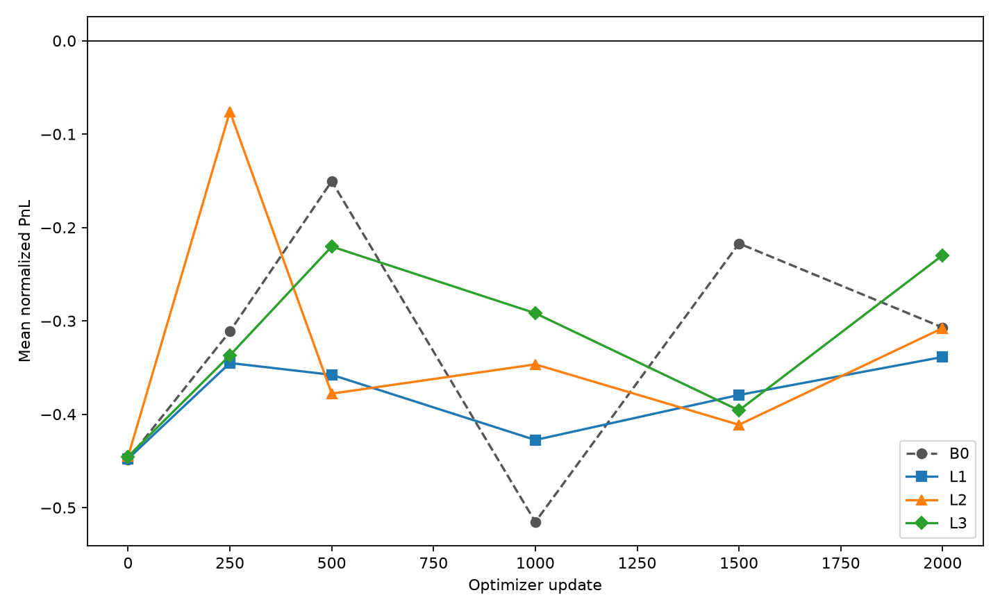

*Figure 16 (G05): checkpoint性能は非単調。update_2000を事前固定し、結果後のbest checkpoint選択は行っていない。*

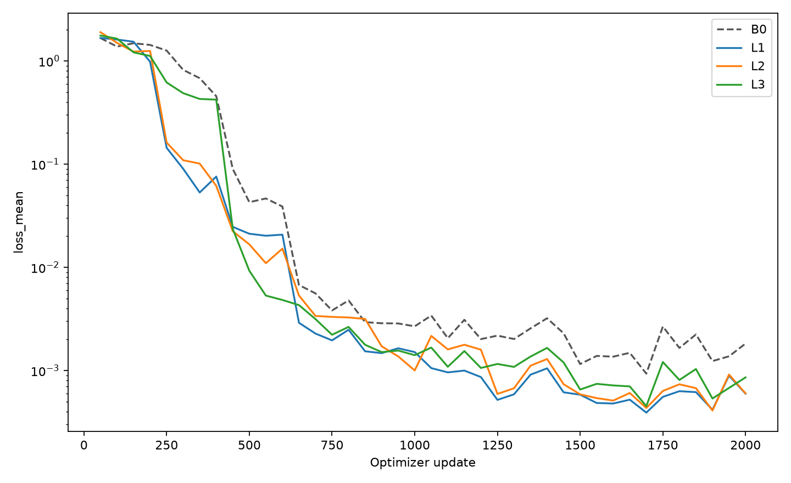

*Figure 17 (G06): lossは全runで低下。log scale。*

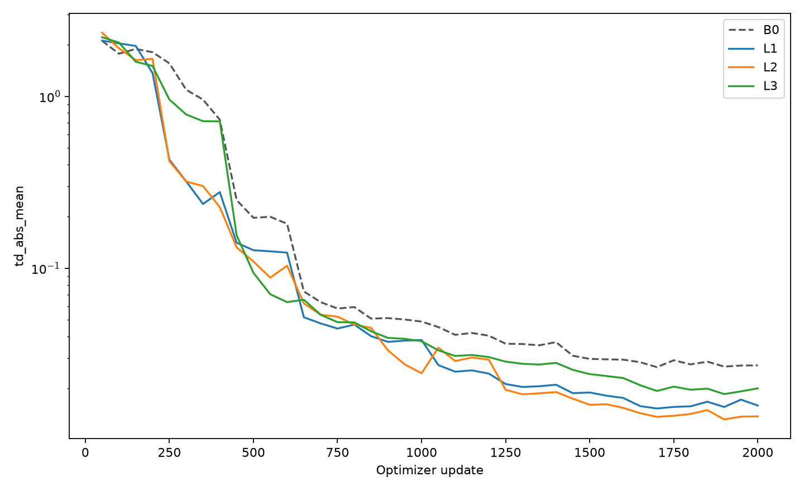

*Figure 18 (G07): |TD error|も低下したが、economic performanceはseed/variantでmixed。*

本研究は、`loss / TD error ↓`と`reward / PnL ↑`が同義でない実例である。optimizerはBellman prediction errorを直接小さくするが、greedy policyが実現するtrajectory rewardは間接的結果である。

## 14. Hypothesis falsification review

| Hypothesis | Result | Evidence |
|---|---|---|
| Lag-1だけでchurn/PnLが改善する | **反証** | DQN/DDQN mean PnL改善なし |
| Lag-1 DDQNは5秒再Entryを恒久的に抑制する | **反証** | 10秒以内93.26%、主に1 decision遅延 |
| history depthを伸ばすとpolicyが変わる | **支持** | L2/L3でEntry、Hold、PnL中心部が変化 |
| L3で典型holdingが27秒になる | **反証** | mean 27.44秒だがmedian 5秒 |
| L3でClose後再Entry問題が解決する | **反証** | 5秒以内84.22%、30秒程度でほぼ全件 |
| window-dropでtotal Entry spikeが10→15→20秒へ移る | **反証** | L3 total Entryはdrop直後に低下 |
| window-dropでsame-side re-entryが増える | **descriptive support** | L1/L2/L3すべて約+9pp、ただしrisk set条件付き |
| L3 central PnLが改善する | **支持方向** | mean/median/positive episode改善 |
| L3がseed/tailまでrobust | **反証** | 1/3 seed悪化、p01/max loss悪化 |
| explicit-history結果が後続の時系列モデルの必要性を証明する | **未確立** | 汎用的な時系列情報の扱いは合理的次候補だが因果未証明 |

## 15. Integrated interpretation

### 15.1 What explicit history accomplished

- agent transition contextはnetworkに利用された。
- depthを伸ばすとDDQN policyは変化した。
- L3では総Entry/Close cycleが減り、一部のpositionを長くHoldした。
- central PnL distributionは改善方向へ動いた。

### 15.2 What explicit history did not accomplish

- 利益モデル化
- 5秒Closeの解消
- Close後即再Entryの解消
- seed robustness
- extreme tail robustness
- history shortageの因果証明
- 後続の時系列モデルが必要であることの証明

### 15.3 次の研究課題

固定Lagを増やすと入力次元とparameter数も増える。本実験はhistoryとcapacityの寄与を分離した比較ではない。ここまでの結果を踏まえ、より一般的な時系列情報の扱いを次の研究課題とした。具体的な後続研究の設計・実装は本公開物の対象外とする。

## 16. Final decision

- Lag-1/2/3 explicit historyをcurrent canonical 59-stateへ採用しない。
- E1へ昇格しない。
- explicit-history E0 phaseはcommitでdurableに固定してcloseする。
- より一般的な時系列情報の扱いを次の研究課題とした。

## 17. Limitations

1. development diagnostic dataでありfresh OOSではない。
2. 432 outcomesは144 market episodes × 3 independently trained seedsで、432独立market episodesではない。
3. B0/L1/L2/L3は独立学習であり、memory depthとの関係はdose-responseに見えても因果曲線ではない。
4. window-drop risk setは時間とともにselectionされる。
5. market-state matched controlを行っていない。
6. L3 central improvementはseed 20260821の寄与が大きい。
7. mean holdingとmedian holdingが大きく乖離する。
8. weights/checkpoints/raw dataは本report packageに含まれない。
9. 後続の時系列モデルは未設計であり、explicit historyから自動的に成功を予測できない。

## 18. Reproducibility and Git provenance

本技術レポートは完了済みE0研究のhistorical evidenceである。公開sourceは当時の実装記録からI12経路を切り出し、入力・出力の入口を整理したもの。全baselineの実行時source、dataset、weights、実行環境まで含むexact historical rerunは保証しない。

公開configは`../config/i12_explicit_history_experiment.json`、入口は`../scripts/run_experiment.py`。利用条件とdataset契約は[package説明](../package/PACKAGE_CONTENTS.md)を参照する。sourceの出典は`../package/SOURCE_PROVENANCE.json`へ記録した。

公開buildの50-update smokeは新しい実行health確認であり、本レポートの性能結果を再評価・置換したものではない。

## 19. Figure index

| Source ID | File | Purpose |
|---|---|---|
| G01 | `../report/figures/g01_seed_level_final_pnl.png` | B0/L1/L2/L3 final normalized PnL by seed |
| G02 | `../report/figures/g02_mean_pnl_by_memory_depth.png` | Mean normalized PnL by explicit-memory depth |
| G03 | `../report/figures/g03_median_pnl_by_memory_depth.png` | Median normalized PnL by explicit-memory depth |
| G04 | `../report/figures/g04_tail_risk_comparison.png` | Tail-risk comparison |
| G05 | `../report/figures/g05_checkpoint_pnl_progression.png` | Checkpoint reward/PnL progression |
| G06 | `../report/figures/g06_huber_loss_progression.png` | Huber loss progression |
| G07 | `../report/figures/g07_td_error_progression.png` | Absolute TD-error progression |
| G08 | `../report/figures/g08_entries_per_episode.png` | Entries per episode |
| G09 | `../report/figures/g09_holding_time_mean_median.png` | Mean and median holding time |
| G10 | `../report/figures/g10_five_second_close_rate.png` | Five-second Close rate |
| G11 | `../report/figures/g11_close_to_reentry_cdf.png` | Close-to-re-entry CDF |
| G12 | `../report/figures/g12_entry_rate_by_time_since_close.png` | Entry rate by same-session time since Close |
| G13 | `../report/figures/g13_same_side_reentry_by_time.png` | Same-side re-entry rate by same-session time since Close |
| G14 | `../report/figures/g14_reversal_rate_by_time.png` | Reversal rate by same-session time since Close |
| G15 | `../report/figures/g15_hold_rate_by_time.png` | Hold rate by same-session time since Close |
| G16 | `../report/figures/g16_window_drop_same_side_reentry.png` | Window-drop re-entry comparison |
| G17 | `../report/figures/g17_q_entry_vs_hold_advantage.png` | Q Entry-vs-Hold advantage by same-session time since Close |
| G18 | `../report/figures/g18_action_distribution.png` | Action distribution |
| G19 | `../report/figures/g19_position_conditioned_actions.png` | Position-conditioned action distribution |
| G20 | `../report/figures/g20_history_availability_qc.png` | History availability and invariant QC |
| G21 | `../report/figures/g21_seed_delta_comparison.png` | Seed delta comparison versus B0 and L1 |
| G22 | `../report/figures/g22_memory_depth_summary.png` | Memory-depth economic and behavior summary |

## 20. Evidence navigation

- `../report/figures/`: 技術レポートのPNG（元画像を保持）
- [Human-readable Experiment Report](human_readable_experiment_report.html): 単体で開ける解説
- [package説明](../package/PACKAGE_CONTENTS.md): config・source・test・dataset契約

集計CSV・実データ・内部receiptは公開packageに含めない。graph generatorは利用者が非公開source dataを別途指定する方式である。

---

**Final note:** 本reportはexplicit agent-history E0研究をcloseする技術記録であり、Lag-3または後続の時系列モデルの正式採用を示さない。
